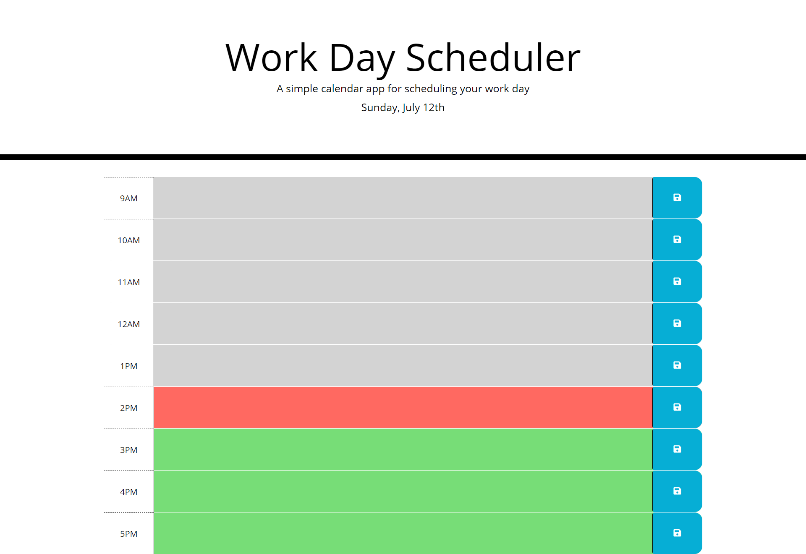

# Homework 05 Third Party API usage

> This is an exercise in using third party client side APIs. 

>  Create a simple calendar application that allows the user to save events for each hour of the day. This app will run in the browser and feature dynamically updated HTML and CSS powered by jQuery, Bootstrap and moment.js.




## Installation

```sh
git clone https://github.com/c-healey/05-homework-daily-planner.git
```

## Usage example

These pages can be used as an example of how to complete your homework assignment for Week 5. Refer to the Readme in the Develop folder for the assignment


## Development setup

This example is an aid and supplement to homework files to help you learn bootstrap, jquery and moment 3rd party client side apis.

- Homework assignment: refer to the Readme in the Devolop folder
- [Bootstrap documentation:](https://getbootstrap.com)
- [JQuery:](https://jquery.com)
- [MomentJS](https://momentjs.com/)
- [Font Awesome](https://use.fontawesome.com/releases/v5.8.1/css/all.css)
- [Google Fonts:](https://fonts.google.com)

As a bonus challenge use Emmet to create the HTML hour rows. Some edits are required.

Use the [Emmet cheatsheet](https://docs.emmet.io/cheat-sheet/) to decode these emmet commands.

> (#hour-$@9.row.time-block>.col-md-1.hour{$@9AM}+textarea.col-md-10.description+button.btn.saveBtn.col-md-1>i.fas.fa-save)*9

> remove this from your textarea fields   name="" id="" cols="30" rows="10"

> Try highlighting one and using Ctrl D to highlight the next to edit all at once.


## Release History

- 0.0.1
  - Work in progress

## Meta

Catherine Healey – [@cfhealey](https://twitter.com/cfhealey) – cathy.healey@gmail.com

Distributed under the MIT license. See `LICENSE` for more information.

[Visit Daily Planner](https://c-healey.github.io/05-homework-daily-planner/)
